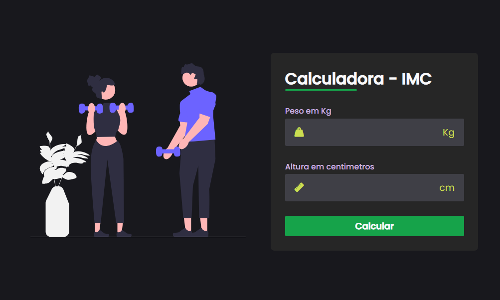

# Calculadora de IMC (Índice de Massa Corporal)

Este é um simples aplicativo web projetado para calcular e fornecer informações sobre o Índice de Massa Corporal (IMC). O IMC é uma medida amplamente utilizada para avaliar se uma pessoa está abaixo do peso, no peso ideal, com sobrepeso ou obesa.

## Como Usar

1. **Preencha as Informações:**
   - Insira seu peso em quilogramas.
   - Insira sua altura em centimetros.

2. **Calcule seu IMC:**
   - Clique no botão de "Calcular".

3. **Resultados:**
   - O aplicativo fornecerá seu IMC.
   - Com base no valor do IMC, você receberá uma classificação, indicando se você está abaixo do peso, no peso ideal, com sobrepeso, com obesidade moderada, com obesidade severa ou obesidade mórbida.

4. **Interpretação dos Resultados:**
   - **Abaixo do Peso:** IMC < 18.5
   - **Peso Ideal:** 18.5 <= IMC < 24.9
   - **Sobrepeso:** 25.0 <= IMC < 29.9
   - **Obesidade Moderada:** 30.0 <= IMC < 34.9
   - **Obesidade Severa:** 35.0 <= IMC < 39.9
   - **Obesidade Mórbida:** IMC >= 40.0

## Tecnologias Utilizadas

- **Front-end:**
  - HTML, CSS, JavaScript

## Visualizações do Projeto

### Calculadora de IMC

#### Desktop

#### Mobile

## Como Contribuir

1. Faça um fork do repositório.
2. Clone o repositório para a sua máquina local.
3. Crie uma branch para a sua contribuição.
4. Faça as alterações desejadas.
5. Envie um pull request.

---

Esperamos que esta calculadora de IMC seja útil para monitorar sua saúde. Se você tiver sugestões ou encontrar problemas, sinta-se à vontade para contribuir ou abrir uma issue. Apreciamos o seu interesse!
